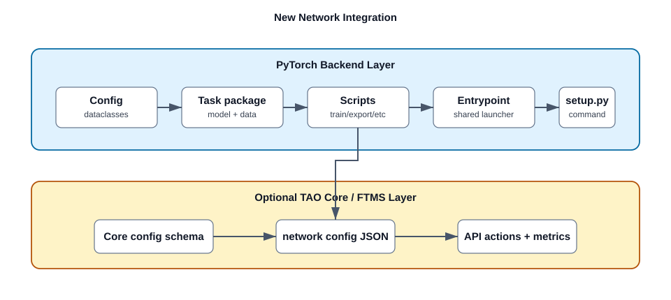

# Integrating a New Network in TAO PyTorch

This guide describes how to add a new model family to the TAO PyTorch backend.
It covers the local PyTorch CLI integration first, then the optional TAO Core /
FTMS integration for API and microservice workflows.

## Two Integration Layers

TAO integration has two related but separate layers:



| Layer | Purpose | Main locations |
| :--- | :--- | :--- |
| PyTorch backend | Makes the model runnable from commands such as `my_net train -e spec.yaml`. | `nvidia_tao_pytorch/<domain>/my_net`, `nvidia_tao_pytorch/config/my_net`, `setup.py` |
| TAO Core / FTMS | Makes the model available through TAO APIs and microservices, including dataset mapping, action mapping, validation, and metrics. | `tao-core/nvidia_tao_core/config/my_net`, `tao-core/nvidia_tao_core/microservices/handlers/network_configs/my_net.config.json` |

Most model work starts in the PyTorch backend. Add TAO Core integration when the
network needs to be exposed through FTMS/API flows.

## Choose a Domain

Place the implementation under the package root that matches the model family:

| Domain | Package root |
| :--- | :--- |
| Computer vision | `nvidia_tao_pytorch/cv` |
| Multimodal | `nvidia_tao_pytorch/multimodal` |
| Self-supervised learning | `nvidia_tao_pytorch/ssl` |
| Synthetic data generation | `nvidia_tao_pytorch/sdg` |
| Point cloud | `nvidia_tao_pytorch/pointcloud` |

The examples below use a CV network named `my_net`.

## Expected Package Structure

Use the same structure as existing task packages such as `ml_recog`,
`depth_net`, or `dino`:

```text
nvidia_tao_pytorch/
  cv/my_net/
    __init__.py
    entrypoint/
      __init__.py
      my_net.py
    scripts/
      __init__.py
      train.py
      evaluate.py
      inference.py
      export.py
      quantize.py        # optional
      prune.py           # optional
      dataset_convert.py # optional
    experiment_specs/
      train.yaml
      evaluate.yaml
      inference.yaml
      export.yaml
    model/
      __init__.py
      build_nn_model.py
      pl_my_net_model.py
    dataloader/
      __init__.py
      pl_my_net_data_module.py
    utils/
      __init__.py
```

Add configuration dataclasses separately under:

```text
nvidia_tao_pytorch/config/my_net/
  __init__.py
  default_config.py
  model.py
  dataset.py
  train.py
  deploy.py   # if export / TensorRT settings are needed
```

## How Command Discovery Works

TAO model commands are registered in `setup.py` under
`entry_points["console_scripts"]`. The shared launcher in
`nvidia_tao_pytorch/core/entrypoint.py` then:

1. imports the model package's `scripts` module,
2. discovers each script as a subtask,
3. adds the common `default_specs` subtask,
4. validates `-e/--experiment_spec_file` for normal subtasks,
5. configures visible GPUs,
6. launches the selected script with Hydra overrides.

That means a new script such as `scripts/export.py` automatically becomes an
`export` subtask after the model command is registered.

## Step 1: Add Config Dataclasses

Define the structured experiment schema under `nvidia_tao_pytorch/config/my_net`.
The top-level `default_config.py` should define `ExperimentConfig`, usually
extending `CommonExperimentConfig`.

Skeleton:

```python
from dataclasses import dataclass

from nvidia_tao_pytorch.config.common.common_config import CommonExperimentConfig
from nvidia_tao_pytorch.config.utils.types import DATACLASS_FIELD
from nvidia_tao_pytorch.config.my_net.dataset import MyNetDatasetConfig
from nvidia_tao_pytorch.config.my_net.model import MyNetModelConfig
from nvidia_tao_pytorch.config.my_net.train import MyNetTrainConfig


@dataclass
class ExperimentConfig(CommonExperimentConfig):
    train: MyNetTrainConfig = DATACLASS_FIELD(
        MyNetTrainConfig(),
        description="Training configuration.",
        display_name="train",
    )
    model: MyNetModelConfig = DATACLASS_FIELD(
        MyNetModelConfig(),
        description="Model configuration.",
        display_name="model",
    )
    dataset: MyNetDatasetConfig = DATACLASS_FIELD(
        MyNetDatasetConfig(),
        description="Dataset configuration.",
        display_name="dataset",
    )

    def __post_init__(self):
        if self.model_name is None:
            self.model_name = "my_net"
```

Use the field helpers from `nvidia_tao_pytorch/config/utils/types.py` so config
metadata is available to schema validation and default-spec generation.

Common helpers include:

```python
BOOL_FIELD
DATACLASS_FIELD
FLOAT_FIELD
INT_FIELD
LIST_FIELD
STR_FIELD
```

## Step 2: Add Experiment Specs

Add YAML specs under `nvidia_tao_pytorch/cv/my_net/experiment_specs`.
Each task script chooses one default YAML through its `hydra_runner` decorator.

Example files:

```text
experiment_specs/train.yaml
experiment_specs/evaluate.yaml
experiment_specs/inference.yaml
experiment_specs/export.yaml
```

Keep the YAML fields aligned with `ExperimentConfig`. Once the command is
registered, validate default-spec generation with:

```sh
my_net default_specs results_dir=/tmp/my_net_specs
```

## Step 3: Add the Entrypoint

Create `nvidia_tao_pytorch/cv/my_net/entrypoint/my_net.py`.

Use the standard wrapper:

```python
import argparse

from nvidia_tao_pytorch.cv.my_net import scripts
from nvidia_tao_pytorch.core.entrypoint import (
    command_line_parser,
    get_subtasks,
    launch,
)


def get_subtask_list():
    return get_subtasks(scripts)


def main():
    parser = argparse.ArgumentParser(
        "my_net",
        add_help=True,
        description="Train Adapt Optimize entrypoint for my_net",
    )
    subtasks = get_subtask_list()
    args, unknown_args = command_line_parser(parser, subtasks)
    launch(vars(args), unknown_args, subtasks, network="my_net")


if __name__ == "__main__":
    main()
```

## Step 4: Register the Console Command

Add the command to `setup.py`:

```python
'my_net=nvidia_tao_pytorch.cv.my_net.entrypoint.my_net:main',
```

Then update the generated command documentation:

```sh
python tools/update_readme_supported_commands.py
```

Use check mode in CI or pre-merge validation:

```sh
python tools/update_readme_supported_commands.py --check
```

## Step 5: Add Task Scripts

Each task script lives under `nvidia_tao_pytorch/cv/my_net/scripts`.
The script should:

1. import the task's `ExperimentConfig`,
2. use `hydra_runner` with the task's default YAML,
3. use `monitor_status`,
4. call a task-specific `run_experiment` function.

Train script skeleton:

```python
import os

from pytorch_lightning import Trainer

from nvidia_tao_pytorch.config.my_net.default_config import ExperimentConfig
from nvidia_tao_pytorch.core.decorators.workflow import monitor_status
from nvidia_tao_pytorch.core.hydra.hydra_runner import hydra_runner
from nvidia_tao_pytorch.core.initialize_experiments import initialize_train_experiment
from nvidia_tao_pytorch.cv.my_net.dataloader.pl_my_net_data_module import MyNetDataModule
from nvidia_tao_pytorch.cv.my_net.model.pl_my_net_model import MyNetPlModel


def run_experiment(cfg):
    resume_ckpt, trainer_kwargs = initialize_train_experiment(cfg)

    dm = MyNetDataModule(cfg)
    dm.setup(stage="fit")

    model = MyNetPlModel(cfg)
    trainer = Trainer(**trainer_kwargs, strategy="auto")
    trainer.fit(model, dm, ckpt_path=resume_ckpt)


spec_root = os.path.dirname(os.path.dirname(os.path.abspath(__file__)))


@hydra_runner(
    config_path=os.path.join(spec_root, "experiment_specs"),
    config_name="train",
    schema=ExperimentConfig,
)
@monitor_status(name="MyNet", mode="train")
def main(cfg: ExperimentConfig) -> None:
    run_experiment(cfg)


if __name__ == "__main__":
    main()
```

For evaluation and inference, use the matching shared helpers:

```python
initialize_evaluation_experiment
initialize_inference_experiment
```

For export, follow existing task-specific `scripts/export.py` files and reuse
common ONNX/export utilities where practical.

## Step 6: Add Model Code

The model package usually contains:

```text
model/
  build_nn_model.py
  pl_my_net_model.py
```

`build_nn_model.py` should build the raw PyTorch module from config.

`pl_my_net_model.py` should implement the Lightning module. Prefer extending
`TAOLightningModule` from `nvidia_tao_pytorch/core/lightning/tao_lightning_module.py`.

The Lightning module normally owns:

* raw model construction,
* pretrained/checkpoint loading,
* `training_step`,
* validation/test/predict logic,
* optimizer and scheduler construction,
* metric logging,
* TAO status logging,
* checkpoint filename conventions.

Keep checkpoint loading behavior explicit. If the network supports public
pretrained checkpoints, encrypted TAO checkpoints, or research checkpoints, make
those cases visible in code and tests.

## Step 7: Add Data Loading

Use a Lightning data module for task scripts that train or evaluate through
PyTorch Lightning:

```text
dataloader/
  pl_my_net_data_module.py
  transforms.py
  build_data_loader.py
```

The data module usually implements:

```python
setup(stage)
train_dataloader()
val_dataloader()
test_dataloader()
predict_dataloader()
```

Use `stage="fit"`, `stage="test"`, and `stage="predict"` consistently with the
task scripts.

## Step 8: Add Export, Quantization, and Deploy Types

Add these only when the network supports the feature:

| Feature | Typical files |
| :--- | :--- |
| ONNX export | `scripts/export.py`, `utils/onnx_export.py`, `config/my_net/deploy.py` |
| TensorRT / engine generation | deploy config, export metadata, converter-compatible outputs |
| Quantization | `scripts/quantize.py`, `nvidia_tao_pytorch/core/quantization` integration |
| Pruning | `scripts/prune.py`, task-specific pruning helpers |
| DeepStream metadata | `types/*_nvdsinfer.py`, `types/*_preprocess.py` |

Export scripts should validate output paths, input shapes, opset versions, and
dynamic axes behavior. If dynamic dimensions are unsafe for a model family,
warn or reject them explicitly.

## Step 9: Add Tests

Add tests under the matching test root:

```text
tests/cv_unit_test/my_net/
  test_config.py
  test_dataloader.py
  test_model.py
  test_trainer.py
  test_export.py
```

Minimum useful coverage:

* config dataclass construction,
* default spec generation,
* dataloader smoke test,
* model forward pass,
* one train/eval smoke path with tiny data or mocks,
* export smoke test if export is supported,
* command documentation check.

Example commands:

```sh
pytest tests/cv_unit_test/my_net
python tools/update_readme_supported_commands.py --check
```

## Step 10: Add TAO Core / FTMS Integration

For API and microservice support, follow
`tao-core/docs/NETWORK_INTEGRATION.md`.

At minimum, add:

```text
tao-core/nvidia_tao_core/config/my_net/default_config.py
tao-core/nvidia_tao_core/microservices/handlers/network_configs/my_net.config.json
```

The network config JSON declares how FTMS maps API concepts to the backend
command and spec fields.

Common top-level sections:

```json
{
  "api_params": {},
  "data_sources": {},
  "dataset_validation": {},
  "dynamic_config": {},
  "additional_download": {},
  "cloud_upload": {},
  "actions_mapping": {},
  "spec_params": {},
  "automl_spec_params": {},
  "metrics": {}
}
```

Important `api_params` fields:

```json
{
  "api_params": {
    "dataset_type": "object_detection",
    "actions": ["train", "evaluate", "export", "inference"],
    "formats": ["coco", "raw"],
    "accepted_ds_intents": ["training", "evaluation", "testing"],
    "image": "TAO_PYTORCH",
    "spec_backend": "yaml",
    "actions_pipe": {
      "train": "train",
      "evaluate": "evaluate",
      "export": "export_with_spec",
      "inference": "inference"
    }
  }
}
```

Data-source mappings tell FTMS how uploaded datasets become experiment spec
fields:

```json
{
  "data_sources": {
    "train": {
      "dataset.train_dataset_dir": {
        "source": "train_datasets",
        "multiple_sources": false,
        "path": "train.tar.gz"
      }
    }
  }
}
```

Prefer absolute dataset paths in config fields. Avoid splitting a dataset path
into separate root and relative path values unless an existing task convention
requires it.

## Final Checklist

Use this checklist before opening a merge request:

* Package exists under the correct domain root.
* `entrypoint/<network>.py` uses the shared launcher.
* Task scripts exist for all supported actions.
* `ExperimentConfig` exists under `nvidia_tao_pytorch/config/<network>`.
* Experiment YAMLs match the dataclass schema.
* Model and dataloader builders are covered by smoke tests.
* Console command is registered in `setup.py`.
* `python tools/update_readme_supported_commands.py --check` passes.
* `default_specs` works for the network.
* Export / quantization / pruning subtasks are tested if present.
* TAO Core network config exists if FTMS/API support is required.
* Documentation is updated for task-specific datasets, checkpoints, and deploy
  constraints.
