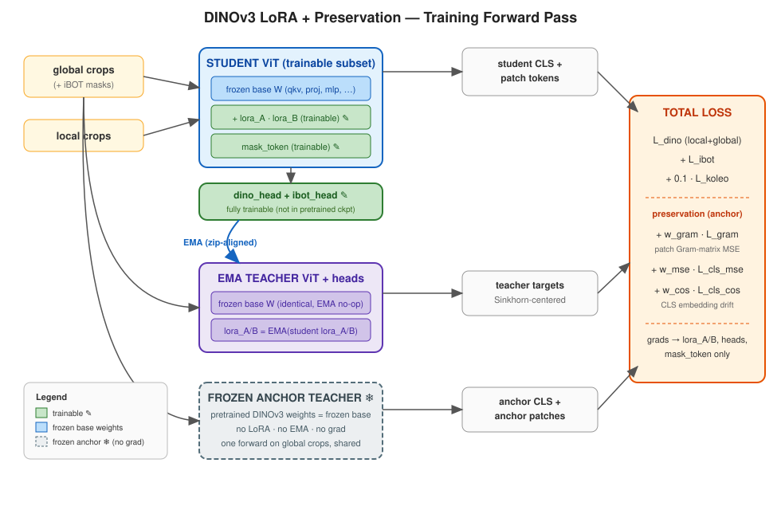
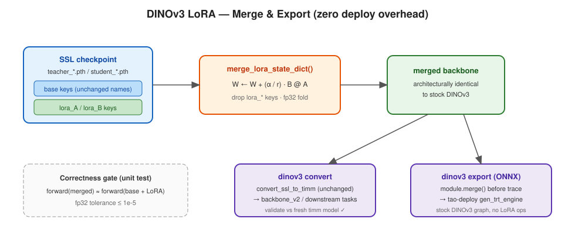

# DINOv3 LoRA + Preservation — Architecture & Design Rationale

Companion to `clip_lora_design.md` (branch `feature/add_clip_lora`). This document maps the
CLIP "LoRA + preservation loss" recipe onto DINOv3 SSL continual pre-training, explains where
the mapping is direct, where DINOv3's student–teacher EMA architecture forces different
decisions, and what already exists in the codebase.

## Diagrams

### Training Forward Pass



### Merge & Export



---

## The thought experiment, validated

The CLIP design's core argument was: *the embedding space is the product*, so parameter-efficient
adaptation must explicitly preserve embedding geometry, not just limit parameter change.

This argument applies to DINOv3 **more strongly** than to CLIP. DINOv3 is consumed as a frozen
feature extractor — the paper's headline claim is state-of-the-art dense performance *without
fine-tuning*. Downstream tasks depend on two geometries:

1. **Patch-token geometry** (dense tasks: segmentation, depth, correspondence) — the pairwise
   cosine structure of patch features.
2. **CLS/global-embedding geometry** (classification: k-NN, linear probe, retrieval).

And critically: **DINOv3 already ships a preservation loss.** Gram anchoring
(paper §4, `ssl/dinov3/model/loss.py::GramLoss`) is an MSE between student and frozen-teacher
patch-cosine Gram matrices. It is the exact structural analog of the CLIP branch's
*similarity-matrix preservation* loss — Meta introduced it to stop dense-feature degradation
during long schedules; with `gram.teacher_source='pretrained'` the TAO implementation already
re-purposes it as an anchor to the loaded DINOv3 weights for continual pre-training.

So the correspondence is:

| CLIP branch component | DINOv3 analog | Status |
|---|---|---|
| Task loss (contrastive) | DINO + iBOT + KoLeo SSL losses | exists (inherited from nvdinov2) |
| Frozen teacher (deepcopy before injection) | Frozen Gram teacher, `teacher_source='pretrained'` | **exists** (`gram_teacher` in `pl_model.py`) |
| Similarity-matrix preservation (image↔text sim MSE) | Gram anchoring (patch↔patch cosine Gram MSE) | **exists** (`GramLoss`) |
| Embedding MSE + cosine preservation (output embeddings) | CLS-token preservation vs frozen teacher | **new** (this proposal) |
| LoRA injection (last-N blocks, attention projections) | Same, into `DinoV3VisionTransformer` blocks | **new** (config stub `LoRAConfig` already reserved, marked "Phase 2") |
| Merge-on-export | Merge in `convert` (timm) and `export` (ONNX) | **new** |

The remaining work is therefore: (a) LoRA injection compatible with the EMA self-distillation
machinery, (b) a small CLS-preservation loss that piggybacks on the existing Gram-teacher
forward, and (c) merge support in the checkpoint/convert/export paths.

## What makes DINOv3 different from CLIP — the three-model problem

CLIP fine-tuning has one trainable model and one optional frozen teacher. DINOv3 SSL has
**three ViTs**:

```
student          — receives gradients
teacher          — EMA of the student (produces DINO/iBOT targets)
gram_teacher     — frozen anchor (pretrained weights), outside FSDP/checkpoint machinery
```

This changes the LoRA design in four places.

### 1. LoRA must be injected into the student AND the EMA teacher

`DinoV2PlModel.update_teacher` performs the EMA by zipping
`student.parameters()` with `teacher.parameters()` element-wise (both in the DDP and the
FSDP flat-param path). Injecting LoRA into the student only would break the zip alignment.

Injecting symmetrically into both is not just a mechanical fix — it is semantically right:

- Base weights are frozen and identical in student and teacher, so their EMA update is a
  mathematical no-op (`m·W + (1−m)·W = W`).
- The teacher's LoRA matrices EMA-track the student's LoRA matrices. The teacher is therefore
  exactly `base + EMA(ΔW_lora)` — the standard DINO teacher semantics restricted to the LoRA
  subspace. Teacher LoRA starts at student init (B = 0 ⇒ identity), so step-0 behavior is
  unchanged.

The **Gram teacher does NOT get LoRA**. It anchors to the original pretrained weights, which
under LoRA are precisely the frozen base weights. (A pleasant corollary: in LoRA mode the Gram
anchor provably cannot drift, whereas in full-FT mode `_sync_gram_teacher` must be careful about
provenance.)

### 2. "Freeze everything" applies to the backbone only

The CLIP recipe freezes the entire model then unfreezes LoRA. That is wrong for DINOv3:

- **DINO/iBOT heads are not in the pretrained checkpoint.** Meta ships inference backbones;
  `restore_pretrained_weights` loads backbone weights only, and the heads are freshly
  initialized. Freezing randomly-initialized heads would destroy the SSL objective. Heads stay
  fully trainable (they are discarded at export anyway).
- **`mask_token` is also absent from the checkpoint** (explicitly flagged in
  `restore_pretrained_weights`) and drives iBOT masking. It must stay trainable.
- Everything else in the backbone freezes: `patch_embed`, `cls_token`, `register_tokens`,
  block weights, final norm.

Trainable set under LoRA: `{lora_A/lora_B in target blocks} ∪ {dino_head, ibot_head} ∪ {mask_token}`.
For ViT-B with rank 8 on qkv+proj of all 12 blocks this is ≈ 0.44 M LoRA params (~0.5% of the
86 M backbone) plus the heads.

### 3. Key-preserving LoRA, not the CLIP wrapper

The CLIP branch wraps `nn.Linear` in a `LoRALinear(nn.Module)` holding the original as
`self.original`, which renames every wrapped weight to `...qkv.original.weight`. DINOv3 cannot
afford key churn — four subsystems depend on stable backbone key names:

- `checkpoint_remap.timm_to_tao` / `convert_ssl_to_timm` (timm ↔ TAO key translation),
- `CustomModelCheckpoint` (strips `student.backbone.` / `teacher.backbone.` prefixes into
  standalone artifacts),
- `_sync_gram_teacher` (`load_state_dict` from the teacher backbone into the plain Gram teacher),
- `restore_pretrained_weights` (non-strict load against reference keys).

Instead, DINOv3 uses an **in-place subclass**: `LoRALinear(nn.Linear)` that takes over the
existing `weight`/`bias` tensors (keys unchanged) and registers `lora_A`/`lora_B` as additional
parameters. Consequences:

- Pretrained loading works unchanged (base keys identical; works whether injection happens
  before or after loading, since load is non-strict).
- `_sync_gram_teacher` needs only a `lora_`-key filter (or `strict=False`); the base keys it
  copies are the frozen originals.
- Stripped `student_*.pth` / `teacher_*.pth` artifacts carry base + `lora_*` keys side by side;
  `convert` learns one new trick: fold `lora_B @ lora_A · (α/r)` into the base weight and drop
  the `lora_*` keys before timm translation.
- `parameters()` ordering is deterministic and identical in student and teacher ⇒ the EMA zip
  stays valid.

### 4. Preservation losses ride the existing `_extra_losses` hook — and share one teacher forward

`DinoV2PlModel.student_forward` exposes `_extra_losses(**ctx)`; DINOv3 already overrides it for
Gram anchoring, running the frozen teacher on the global crops under `no_grad`. The same forward
output dict contains `x_norm_clstoken` alongside `x_norm_patchtokens` — so CLS preservation is
**free** (no second teacher pass, unlike the CLIP implementation which runs its teacher
separately):

```
anchor_out = gram_teacher(global_crops)            # one forward, no grad
L_gram     = MSE(Gram(student_patches), Gram(anchor_patches))          # exists
L_cls_mse  = MSE(student_cls, anchor_cls)                              # new
L_cls_cos  = 1 − cos(student_cls, anchor_cls)                          # new
```

Total loss:

```
L = L_dino_local + L_dino_global + 0.1·L_koleo + L_ibot
    + w_gram·L_gram + w_cls_mse·L_cls_mse + w_cls_cos·L_cls_cos
```

Defaults follow the CLIP branch's "gentle constraint" philosophy: `w_cls_mse = 0.05`,
`w_cls_cos = 0.05`. For `w_gram`, the paper's refinement phase uses a strong weight (order 1–2)
because Gram anchoring there fights active degradation; for domain adaptation start at
`w_gram = 1.0` and ablate. `gram.start_step = 0` in LoRA mode (anchor from the first step —
there is no "early training" phase to protect).

One structural refactor: the frozen anchor teacher must be buildable when *either*
`gram.enable` *or* `preservation.enable` is set (today its construction is gated on
`gram.enable` alone).

## The SSL-specific drift argument

In CLIP, task loss and preservation loss visibly oppose each other. In DINOv3 the tension is
subtler and arguably more dangerous: the SSL objective is **self-referential**. The DINO/iBOT
targets come from the EMA teacher, which itself follows the student. On a narrow domain with a
small dataset, nothing in the objective ties the representation to the pretrained geometry —
student and teacher can drift *together* toward domain-degenerate features (the partial-collapse
failure mode; Sinkhorn centering and KoLeo resist full collapse but not domain overfitting).
LoRA bounds the drift subspace (rank-r per projection) but not its magnitude.

The frozen Gram teacher is the only exogenous anchor in the system. That is why preservation is
not an optional nicety here: **LoRA-mode continual pre-training should enable Gram anchoring by
default.** The paper's own evidence (§4.1: dense features degrade while global metrics improve,
i.e. patch geometry is the first casualty of continued training) says patch-level preservation
matters most; CLS preservation guards the global geometry that k-NN/linear-probe users depend on.

## Configuration

Extends the existing `LoRAConfig` stub and adds `PreservationConfig` in
`config/dinov3/default_config.py`:

```yaml
model:
  lora:
    enable: true
    rank: 8                    # existing stub field
    alpha: 16.0                # existing stub field
    dropout: 0.05
    target_modules: [qkv, proj]   # optionally fc1, fc2 (mlp); SwiGLU archs: fused fc1, fc2
    num_last_blocks: 0         # 0 = all blocks
  gram:
    enable: true               # recommended default in LoRA mode
    w_gram: 1.0
    start_step: 0
    teacher_source: pretrained # 'ema' refresh is a full-FT concept; keep 'pretrained' with LoRA
  preservation:                # new block
    enable: true
    cls_mse_weight: 0.05
    cls_cosine_weight: 0.05
```

Independent toggles, mirroring the CLIP matrix:

| lora | gram/preservation | Behavior |
|---|---|---|
| off | off | Current full-FT continual pre-training (unchanged) |
| on | off | Plain LoRA SSL — parameter-efficient, drift bounded by rank only |
| off | on | Full FT with anchoring (gram already supports this today) |
| on | on | **Recommended**: parameter-efficient + geometry-preserving |

Guardrails (assert at build time): `lora.enable` is incompatible with `distill.enable` (v1) and
with `gram.teacher_source='ema'` (EMA refresh would re-anchor to the drifting teacher, defeating
preservation; also FSDP-gather semantics differ). FSDP + LoRA is deferred (v1 = single-GPU/DDP;
ViT-B/L LoRA fits easily in DDP since optimizer state is tiny — FSDP's motivation largely
disappears).

## Injection point and lifecycle

```
train.py:
  1. DinoV3PlModel(cfg)              # _build_model: student/teacher/gram_teacher, plain Linears
  2. restore_pretrained_weights()    # timm remap → student; mirror → teacher; sync gram_teacher
  3. inject_lora(student.backbone)   # freeze base, add lora_A/B (B=0)
     inject_lora(teacher.backbone)   # identical structure; all teacher params stay requires_grad=False
  4. trainer.fit()                   # configure_model (wrap) sees final structure; resume ckpts match
```

Injecting *after* weight load keeps `restore_pretrained_weights` untouched. Injecting *before*
`fit` means Lightning resume checkpoints and FSDP wrapping always see the final module tree.

`configure_optimizers` needs no structural change: it already skips `requires_grad=False`
params, and its `blocks.N.` layer-id parser handles `blocks.N.attn.qkv.lora_A` via its existing
`int(after_block[0])` fallback (LoRA params inherit layerwise LR decay and weight decay; both
acceptable, revisit in ablation). One addition: log a trainable-parameter report at injection
(as the CLIP `inject_lora` does).

## Export paths

Both consumers get merge-before-translate:

- **`convert`** (SSL ckpt → timm backbone for `backbone_v2` / downstream tasks): new
  `merge_lora_state_dict()` in `checkpoint_remap.py` — fold `ΔW = lora_B @ lora_A · α/r` into
  each base weight, drop `lora_*` keys, then the existing `convert_ssl_to_timm` runs unchanged.
  The `validate` flag then confirms the merged dict loads into a fresh timm DINOv3 — zero
  deploy-time footprint, architecturally identical to stock DINOv3.
- **`export`** (ONNX, uses `teacher.backbone`): call module-level `merge()` on the loaded model
  before tracing.

Merge correctness is a unit test: `forward(merged) ≈ forward(base + lora)` to fp32 tolerance.

## Downstream consumption of the adapted backbone

The merged timm-format backbone is the **universal currency**: every DINOv3 consumer in
tao-pytorch loads a timm-format state dict through `pretrained_backbone_path`, so a
continually-adapted backbone drops into all of them with **zero downstream code changes**.
That is the payoff of merge-on-convert + key-preserving LoRA.

| Downstream task | Backbone entry | Load path |
|---|---|---|
| `classification_pyt` | `backbone_v2` registry: `dinov3_vits16 / vits16plus / vitb16 / vitl16 / vith16plus / vit7b16` | `timm.create_model(..., checkpoint_path=<converted>)`; `DINOV3Wrapper.load_state_dict` routes bare timm keys via `inner.` prefixing |
| `segformer` (semantic seg) | ViT-Adapter backbones `vit_{small,small_plus,base,large,huge_plus}_dinov3` | state dict loaded into the wrapped timm Eva model after construction (`SegFormer.__init__`, non-strict) |
| `visual_changenet` (classification + segmentation) | `vit_*_dinov3` backbones | same post-construction `pretrained_backbone_path` load |

Workflow:

```
dinov3 train (LoRA + preservation, source=teacher recommended)
  → dinov3 convert   (merge lora → timm .safetensors, validate=True)
  → downstream spec: model.backbone.type=vit_base_dinov3 (or dinov3_vitb16)
                     model.backbone.pretrained_backbone_path=<converted file>
```

Two consumption modes downstream, and preservation determines which is viable:

- **Frozen-backbone** (`freeze_backbone=true` in segformer/changenet, `freeze_at` in
  classification): the DINOv3-intended mode — train only the task head/adapter on the adapted
  features. This is exactly where preservation pays off: the adapted backbone must still carry
  general geometry because the task head gets no chance to compensate for drift. An
  over-drifted backbone (arm A/B in the ablation) shows up here first.
- **Full fine-tune downstream**: works too, but then SSL-stage preservation matters less —
  the task loss will reshape features anyway.

The convert `validate=True` flag already gates compatibility (merged dict must load into a
fresh timm DINOv3). Phase 3.2 adds an end-to-end parity check: features from the in-training
merged student vs. the converted backbone loaded through `backbone_v2`.

### Deferred alternative: adapter-style distribution (v2)

Instead of shipping a merged 330 MB backbone per domain, ship one stock base + per-domain
`lora_*`-only files (~2 MB for ViT-B rank 8): `N domains = 1 base + N adapters`. Downstream
consumption would need an `inject_lora` + adapter-load hook in `backbone_v2` (and each wrapped
backbone), which also unlocks **LoRA continuation** — initializing the downstream task's LoRA
from the SSL adapter and continuing task training in the same low-rank subspace with the base
still frozen. Deliberately out of v1: it touches every consumer, while the merged path touches
none. The stripped `student/teacher_*.pth` artifacts already contain the `lora_*` keys, so v2
needs no new training-side output — only an `--adapter-only` export flag and the consumer hook.

## Memory & cost

| Item | Full FT (today) | LoRA + preservation |
|---|---|---|
| Backbones in memory | 2–3 (student, teacher, gram teacher if enabled) | 3 (gram/anchor teacher required) |
| Trainable params (ViT-B) | 86 M + heads | ~0.44 M LoRA + heads + mask_token |
| Optimizer state (AdamW) | 2× 86 M + heads | negligible |
| Extra forward per step | +1 anchor forward when gram on | same (+CLS preservation is free — same forward) |
| Backward | full graph | full graph (activations dominate; LoRA saves optimizer/grad memory, not activation memory) |

Honest caveat (same as any LoRA-on-ViT): backward-pass activation memory is *not* reduced,
because gradients still flow through the frozen layers to reach LoRA modules in earlier blocks.
The savings are optimizer state, gradient buffers, and checkpoint size — plus the regularization
benefit that motivates this design. `gram.teacher_scale > 1` remains the memory knob to watch.

## Risks

| # | Risk | Mitigation |
|---|---|---|
| R1 | EMA zip misalignment if injection differs between student/teacher | Single `inject_lora` call path used for both; unit test asserts `[n for n,_ in student.named_parameters()] == teacher` names |
| R2 | `_sync_gram_teacher` `load_state_dict` failure on `lora_*` keys | Filter `lora_` keys before load; assert base keys fully covered |
| R3 | Stripped checkpoint artifacts / convert break on lora keys | Key-preserving design + explicit merge step + round-trip test vs timm |
| R4 | Preservation over-constrains, domain adaptation stalls | CLIP-style ablation phase: progressively enable w_gram, cls weights; monitor in-domain k-NN vs retention metrics |
| R5 | Heads-trainable + backbone-frozen imbalance destabilizes DINO loss (head races ahead) | Existing `last_layer_learning_rate` freeze/schedule already covers the DINO-head prototype layer; monitor loss curves in smoke |
| R6 | FSDP flat-param wrapping of mostly-frozen modules | Out of scope v1 (assert); follow-up with `use_orig_params=True` |

## Comparison to the CLIP branch

| Aspect | CLIP branch | DINOv3 (this design) |
|---|---|---|
| LoRA wrapper | `.original`-nesting module | key-preserving `nn.Linear` subclass |
| Freeze scope | whole model | backbone only (heads + mask_token trainable) |
| Teacher for preservation | new deepcopy before injection | existing frozen Gram teacher (no new copy) |
| Teacher forward cost | extra forward per step | shared with Gram anchoring (one forward) |
| Similarity preservation | image↔text sim matrix | patch↔patch Gram matrix (already shipped) |
| Embedding preservation | image + text embeddings | CLS token (global crops) |
| EMA interaction | none | LoRA injected into EMA teacher too |
| Merge target | ONNX export | `convert` (timm) + `export` (ONNX) |
