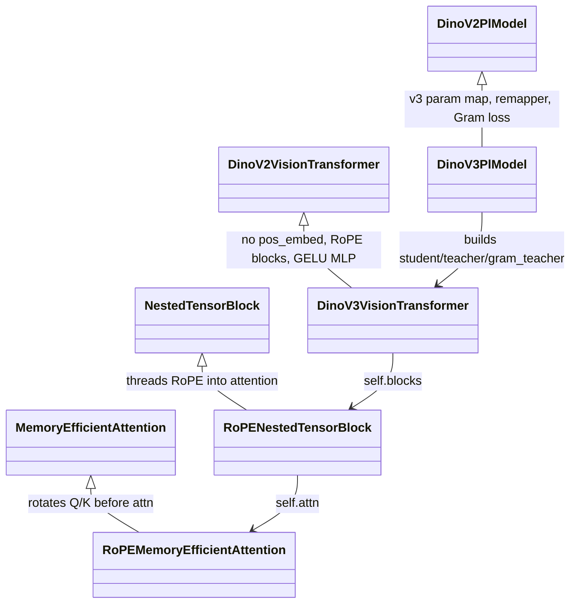
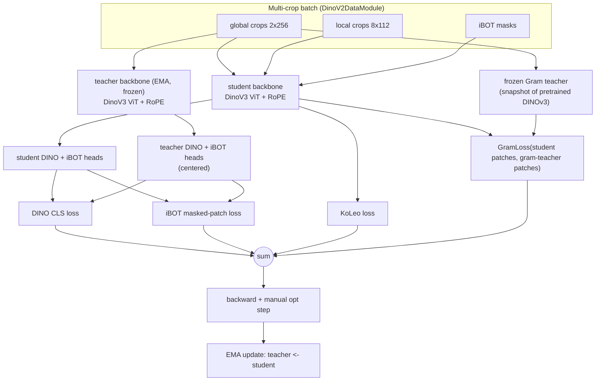
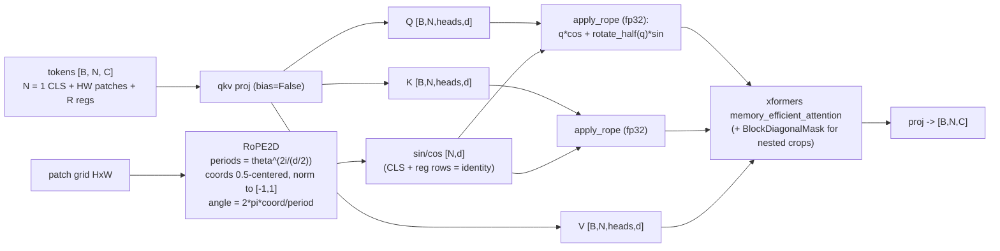
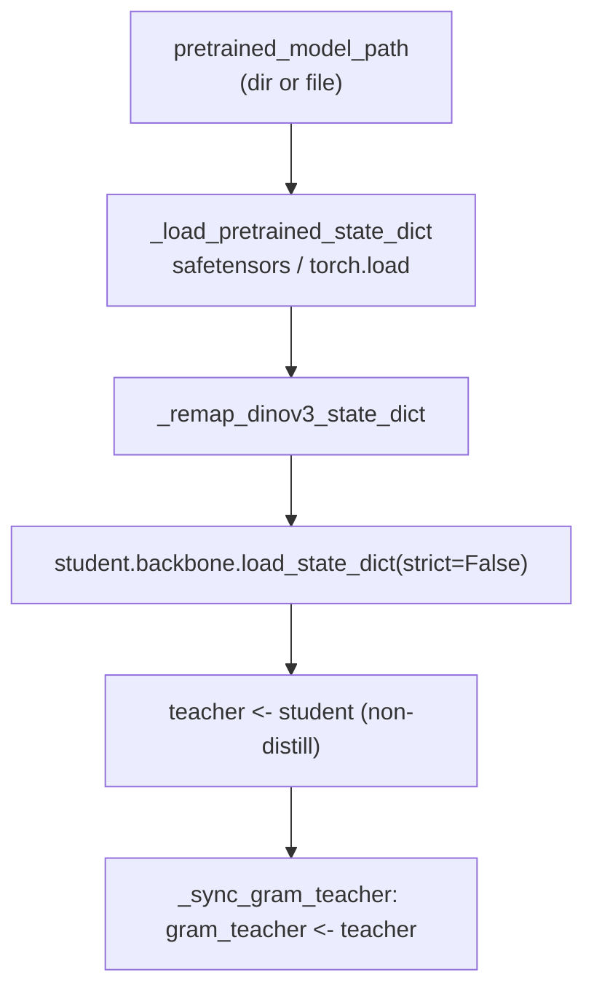
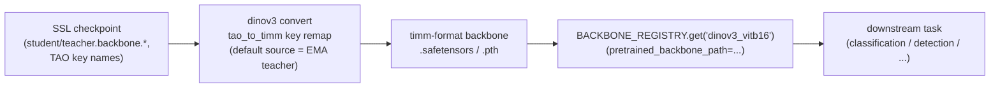

# TAO DINOv3 — Self-Supervised Continual Pre-training (ViT-B)

This package implements **DINOv3** self-supervised learning in TAO as a new `ssl/dinov3`
family. It is built for **continual pre-training**: start from public DINOv3 weights and keep
training (DINO + iBOT + KoLeo + **Gram anchoring**) to adapt the backbone to a new domain.

> The family/endpoint is named **`dinov3`** (not `nvdinov3`). NVIDIA's own DINOv2 variant
> **`nvdinov2`** keeps its name and stays frozen — `dinov3` inherits from it.

Candidate v1 architecture: **ViT-B** (embed 768 / depth 12 / heads 12 / patch 16 / 4 register
tokens / standard GELU MLP), single-resolution 256. **`vit_l`** (1024/24/16) is also supported
(Phase 2); `vit_h_plus` is reserved for a later size step.

---

## Table of contents

1. [Design philosophy: inherit, don't fork](#1-design-philosophy-inherit-dont-fork)
2. [Command & file map](#2-command--file-map)
3. [Training data flow (one step)](#3-training-data-flow-one-step)
4. [The single edit to `nvdinov2`: the `_extra_losses` hook](#4-the-single-edit-to-nvdinov2-the-_extra_losses-hook)
5. [RoPE: 2D axial rotary position embedding](#5-rope-2d-axial-rotary-position-embedding)
6. [Token layout & the checkpoint remapper (loading DINOv3 weights)](#6-token-layout--the-checkpoint-remapper-loading-dinov3-weights)
7. [Gram anchoring](#7-gram-anchoring)
8. [Configuration](#8-configuration)
9. [Running it](#9-running-it)
10. [Downstream use: `backbone_v2` interop](#10-downstream-use-backbone_v2-interop)
11. [Tests & verification status](#11-tests--verification-status)
12. [References](#12-references)

---

## 1. Design philosophy: inherit, don't fork

DINOv3 differs from `nvdinov2` in only three places: **positional encoding** (2D axial RoPE
instead of an absolute `pos_embed`), the **FFN activation** (GELU MLP vs SwiGLU), and an extra
**Gram-anchoring** loss. Everything else — the DINO/iBOT/KoLeo losses, the projection heads, the
EMA teacher, the warmup-cosine schedulers, the entire dataloader, and checkpointing — is
identical.

So instead of copying `nvdinov2`, `dinov3` **subclasses** it (Strategy A) and overrides only
what changes. `nvdinov2` is touched exactly once: a no-op `_extra_losses` hook.



**What is reused unchanged (by import):** `DinoV2Loss`, `KoLeoLoss`, `DinoHead`, the whole
`nvdinov2/dataloader/`, `LambdaWarmUpCosineScheduler`, `CustomModelCheckpoint`, and the entire
Lightning training/EMA/optimizer flow in `DinoV2PlModel`.

---

## 2. Command & file map

The `dinov3` console command is registered in `setup.py` and dispatches to the subtask scripts
exactly like every other TAO task (`entrypoint/` → `scripts/` → `model/`).

```
console: dinov3 {train, inference, export, convert, default_specs}
  └─ ssl/dinov3/entrypoint/dinov3.py     # discovers subtasks, launches
       ├─ ssl/dinov3/scripts/train.py     # @hydra_runner + @monitor_status; builds DinoV3PlModel
       │    └─ ssl/dinov3/model/pl_model.py        DinoV3PlModel(DinoV2PlModel)
       │         ├─ model/vit.py                   DinoV3VisionTransformer(DinoV2VisionTransformer)
       │         │    └─ model/layers/block.py     RoPENestedTensorBlock(NestedTensorBlock)
       │         │         └─ model/layers/attention.py  RoPEMemoryEfficientAttention
       │         │              └─ model/layers/rope.py   RoPE2D, apply_rope, rotate_half
       │         └─ model/loss.py                  GramLoss
       └─ ssl/dinov3/scripts/convert.py   # SSL backbone -> timm/backbone_v2 layout (CPU)
            └─ ssl/dinov3/utils/checkpoint_remap.py   # bidirectional timm<->TAO key remap

config/dinov3/default_config.py          # dataclass schema (subclasses nvdinov2)
ssl/dinov3/experiment_specs/train_dinov3_vitb.yaml
tests/ssl_unit_test/dinov3/              # config, rope, rope_parity, loss, model,
                                         # feature_parity, backbone_v2_interop
```

| Subtask | Reuses from nvdinov2 |
| :--- | :--- |
| `train` | `DinoV2DataModule`, full Lightning `fit` flow |
| `inference` | inference flow + data module |
| `export` | ONNX export flow |
| `convert` | DINOv3-specific (SSL → `backbone_v2` timm layout); see §10 |
| `default_specs` | auto-generated from the dataclass schema |

---

## 3. Training data flow (one step)

A step is the inherited `DinoV2PlModel.training_step`: the EMA **teacher** sees the global crops,
the **student** sees global + local crops, and the loss is DINO (CLS) + iBOT (masked patches) +
KoLeo + (new) **Gram**. The only DINOv3-specific additions are the RoPE inside each backbone and
the Gram term injected through the `_extra_losses` hook.



The Gram branch (`GT` + `LG`) is the **only** thing added to the v2 loss path, and it is added
through one extension point, described next.

### Centering: Sinkhorn-Knopp (⚠️ watch-for)

DINOv3 centers the teacher's DINO/iBOT head outputs with **Sinkhorn-Knopp** (SwAV), not the
**softmax** centering `nvdinov2` hardcodes. `DinoV3PlModel` rebuilds the two `DinoV2Loss` objects
with `centering_method` from config (**default `sinkhorn`**) right after `super().__init__()` — a
dinov3-side override only; `nvdinov2` is untouched.

The Sinkhorn path in `DinoV2Loss` was previously **marked untested**. It is now exercised by:
- `tests/ssl_unit_test/dinov3/test_sinkhorn.py` (CPU) — asserts the output is a valid per-sample
  probability simplex (rows sum to 1, non-negative, finite) across the spec's teacher-temperature
  range, for both the DINO (CLS) and iBOT (masked-patch) shapes; and
- the GPU model test, which runs a full teacher/student step through the sinkhorn path.

It is numerically safe here because `DinoHead` L2-normalizes features against unit-norm
prototypes, so teacher logits are cosine similarities in `[-1, 1]` and `exp(logit / 0.04)` cannot
overflow fp32.

> **Watch for:** if T7 (or any later) training shows instability or representation **collapse**,
> suspect the centering path **first** and fall back to softmax:
> `dinov3 train ... model.centering_method=softmax`. Keep this note even if softmax is adopted, so
> the next session knows the state.

---

## 4. The single edit to `nvdinov2`: the `_extra_losses` hook

`DinoV2PlModel.student_forward` accumulates loss terms in a list and sums them. We added one
seam so subclasses can contribute terms without copying the method:

```python
# nvdinov2/model/pl_model.py  (base — returns [], so DINOv2 numerics are unchanged)
def _extra_losses(self, **ctx):
    return []

# ... inside student_forward, right before `loss = sum(losses)`:
losses += self._extra_losses(
    global_crops=..., local_crops=..., global_masks=...,
    student_backbone_global_output=..., student_backbone_local_output=..., ...,
)
```

Because the base returns `[]`, **DINOv2 is bit-identical** (guarded by the nvdinov2 regression
test). `DinoV3PlModel` overrides it to return `[w_gram * GramLoss(...)]`.

---

## 5. RoPE: 2D axial rotary position embedding

DINOv3 has **no learnable `pos_embed`**. Position is encoded by rotating the query/key vectors of
**patch tokens only** inside attention; `[CLS]` and register tokens get an identity rotation.



### Numerically matched to the timm reference

`RoPE2D` was written to be **bit-for-bit aligned** with timm's `RotaryEmbeddingDinoV3` (the
`vit_base_patch16_dinov3.lvd1689m` reference), since the frequency schedule is the highest-risk
piece of the port:

- `periods = theta ** (2·i / (head_dim/2))`, `i = 0 .. head_dim/4 − 1`; **`theta = 100.0`**.
- coords are **0.5-centered**, **per-axis normalized** (`normalize_coords="separate"`) and mapped
  to `[-1, 1]` (`make_coords_dinov3`, `grid_indexing="ij"`).
- `angle = 2π · coord / period`; the two axes' angles are concatenated then **tiled**
  (`[h, w, h, w]` — the `rotate_half` layout), and applied as `x·cos + rotate_half(x)·sin`.

This is verified by `tests/ssl_unit_test/dinov3/test_rope_parity.py` (CPU) and end-to-end by the
feature-parity smoke test (§7).

### FSDP / nested-crop notes
- The `periods` schedule is a **non-persistent buffer** (FSDP won't shard it; not in the
  checkpoint).
- RoPE is applied **before** the xformers call. For the nested multi-crop path, per-crop sin/cos
  tables are concatenated to match `BlockDiagonalMask`'s token layout (`block.py::_build_rope_cat`,
  keyed off `attn_bias._batch_sizes`).

---

## 6. Token layout & the checkpoint remapper (loading DINOv3 weights)

### Token order: ours vs timm — and why it doesn't matter

```
timm DINOv3 :  [ CLS | reg0 reg1 reg2 reg3 | patch_0 ... patch_{HW-1} ]   (registers as prefix)
TAO dinov3  :  [ CLS | patch_0 ... patch_{HW-1} | reg0 reg1 reg2 reg3 ]   (registers at the tail)
```

We keep `nvdinov2`'s **end-of-sequence** register layout. This is safe: attention is full
(bidirectional) and therefore **permutation-equivariant**, and registers carry **identity RoPE**,
so the `[CLS]` and patch outputs are invariant to where the registers sit. The remapper therefore
only **renames** the register parameter — it never reorders tokens. (Confirmed by the parity test:
cosine > 0.99 against timm.)

### Key remapping

The public DINOv3 ViT-B ships **timm-format** weights (162 tensors, no `pos_embed`, no QKV bias).
`DinoV3PlModel.restore_pretrained_weights` resolves the file (directory of `model.safetensors` /
`pytorch_model.bin`, or a direct `.safetensors`/`.pth`/`.bin`), remaps the keys, and loads
non-strict.



| timm key | TAO key | note |
| :--- | :--- | :--- |
| `reg_token` | `register_tokens` | rename only (placement is irrelevant, see above) |
| `blocks.N.gamma_1` | `blocks.N.ls1.gamma` | LayerScale module vs raw param |
| `blocks.N.gamma_2` | `blocks.N.ls2.gamma` | LayerScale module vs raw param |
| `cls_token`, `patch_embed.proj.*`, `blocks.N.{norm1,norm2,attn.qkv,attn.proj,mlp.fc1,mlp.fc2}.*`, `norm.*` | identity | map unchanged |
| *(none)* | `mask_token` | iBOT param, **kept initialized** (absent from inference checkpoint) |
| `pos_embed` | — | does not exist in DINOv3 (RoPE) |

The remapper covers **all 162** checkpoint tensors with only `mask_token` left initialized.

> **Parity-critical architecture facts** (discovered by introspecting timm and required for the
> features to match): `qkv_bias=False`, `act_layer=GELU` (not SiLU), `qk_norm=False`. These are the
> `DinoV3VisionTransformer` defaults and are passed explicitly in `_make_backbone`.

---

## 7. Gram anchoring

Gram anchoring stabilizes dense features during long pre-training by keeping the student's
patch-token **feature geometry** close to a frozen reference. `GramLoss` is the MSE between the
student's and a frozen teacher's **cosine Gram matrices** of patch tokens:

```
G(X) = normalize(X, dim=C) @ normalize(X, dim=C).T      # [B, N, N], scale-invariant, fp32
L_gram = MSE( G(student_patches), G(gram_teacher_patches) )
```

The **frozen Gram teacher** is a separate copy of the backbone, deliberately kept **outside** the
`student`/`teacher` `ModuleDict`s so the parent's FSDP wrapping and `CustomModelCheckpoint` ignore
it. It never receives gradients or EMA updates; it is (re)anchored to the loaded DINOv3 weights via
`_sync_gram_teacher` at construction and again after `restore_pretrained_weights`.

It is wired in through the hook (gated by `gram.enable` and `gram.start_step`):

```python
# DinoV3PlModel._extra_losses
if not gram.enable or self.global_step < gram.start_step:
    return []
teacher_patches = self.gram_teacher(global_crops)["x_norm_patchtokens"]   # no_grad, eval
return [gram.w_gram * GramLoss()(student_patches, teacher_patches)]
```

### High-resolution phase (Phase 1)

Gram earns its keep in the high-res 256→768 adaptation phase (the paper doesn't use it for
ViT-B at 256). The high-res spec `experiment_specs/train_dinov3_vitb_highres.yaml` turns it on and
adds two knobs handled in `_extra_losses`:

- **`gram.teacher_source: ema` + `gram.refresh_interval`** — an *early-EMA* Gram teacher refreshed
  every N steps from the current EMA teacher (vs the Phase 0 frozen-from-pretrained snapshot).
  `refresh_interval: 0` keeps the Phase 0 behavior.
- **`gram.teacher_scale`** — the Gram teacher runs at this multiple of the student resolution
  (paper uses 2×); the higher-res teacher grid is average-pooled back to the student grid before
  the loss. `1.0` = same resolution. At 768 the 2× teacher is memory-heavy — start at `1.0`.

RoPE needs no change at 768: `RoPE2D` normalizes coords to `[-1,1]`, so a 48×48 grid extrapolates
with no interpolation (validated by the 768 case of the feature-parity test). See the Phase 1
plan in `dinov3_docs/` for the full design and remaining FSDP-refresh follow-up.

---

## 8. Configuration

`config/dinov3/default_config.py` subclasses the nvdinov2 dataclasses and adds only the v3 pieces.
Config precedence is the standard TAO chain: `dataclass defaults → experiment YAML → CLI Hydra
overrides`.

| Group | Key fields (v3 additions / overrides) |
| :--- | :--- |
| `model` | **`centering_method=sinkhorn`** (DINOv3 SwAV centering; `softmax` fallback — see §3) |
| `model.backbone` | `student_type`/`teacher_type` (`vit_b`), `patch_size=16`, `num_register_tokens=4`, `img_size=256`, **`rope_theta=100.0`** |
| `model.gram` | `enable`, `w_gram`, `start_step`, `teacher_source`, `refresh_interval`, `teacher_scale` — **off by default** in the baseline spec; turned on for the high-res phase (see §7) |
| `model.lora` | disabled stub (forward-compat, Phase 2) |
| `dataset.transform` | `global_crops_size=256`, `local_crops_size=112` (single-res 256) |
| `model.head`, `model.distill`, `train`, `inference`, `export` | reused from nvdinov2 |

v3 param map (`vit_b` is the bring-up target):

| arch | embed | depth | heads | FFN |
| :--- | :--- | :--- | :--- | :--- |
| `vit_b` | 768 | 12 | 12 | GELU MLP |
| `vit_l` *(Phase 2; spec `train_dinov3_vitl.yaml`)* | 1024 | 24 | 16 | GELU MLP |
| `vit_h_plus` *(reserved)* | 1280 | 32 | 20 | SwiGLU |

---

## 9. Running it

Inside the TAO PyTorch dev container (`tao_pt`). The dev base image has no TAO packages, so the
first run installs them (`pip install -e tao-core/.` then `python setup.py develop`, ~10–15 min
CUDA compile). Use `NCCL_P2P_DISABLE=1` for multi-GPU on PCIe-P2P-broken boxes.

```bash
# Pretrained DINOv3 ViT-B weights (timm-format), gated on HF — accept the license first:
#   https://huggingface.co/facebook/dinov3-vitb16-pretrain-lvd1689m
#   hf download timm/vit_base_patch16_dinov3.lvd1689m --local-dir <weights_dir>

dinov3 train -e experiment_specs/train_dinov3_vitb.yaml \
    train.pretrained_model_path=<weights_dir> \
    results_dir=<output_dir>

dinov3 inference -e experiment_specs/train_dinov3_vitb.yaml inference.checkpoint=<ckpt>
dinov3 export    -e experiment_specs/train_dinov3_vitb.yaml export.checkpoint=<ckpt>
dinov3 convert   -e experiment_specs/train_dinov3_vitb.yaml convert.checkpoint=<ckpt>  # see §10
```

`pretrained_model_path` may be a directory (the remapper finds `model.safetensors`) or a file.
`export.checkpoint` accepts either a stripped teacher-backbone checkpoint or a full Lightning
training checkpoint; for a full checkpoint, export explicitly selects and logs
`teacher.backbone`.

---

## 10. Downstream use: `backbone_v2` interop

`ssl/dinov3` **produces** a domain-adapted backbone; downstream supervised tasks (classification,
detection, …) **consume** backbones through the `cv/backbone_v2` registry, where DINOv3 already
exists as the timm-wrapped `dinov3_vitb16` entry. These are two intentionally separate
representations of the same architecture (the SSL trainer subclasses `nvdinov2`; the registry
entry wraps timm) — see the note at the end of this section for why.

Because the two ViTs are **numerically identical** (proven by the feature-parity test, §11), the
handoff is a pure **key remap**, not a retrain. The `dinov3 convert` subtask runs the inverse of
the weight-loading remapper (§6) and writes a timm-format backbone that the existing registry
entry loads directly via `pretrained_backbone_path` — **nothing in `backbone_v2` changes**.



```bash
# 1) Export the EMA-teacher backbone from an SSL checkpoint into timm layout.
dinov3 convert -e experiment_specs/train_dinov3_vitb.yaml \
    convert.checkpoint=<results_dir>/train/teacher_epoch_XXX_step_YYYYY.pth \
    convert.output_path=<out>/dinov3_vitb_backbone.safetensors
    # convert.source defaults to "teacher" (EMA); "student"/"student_ema" also valid.
```

```python
# 2) Consume it downstream via the existing backbone_v2 registry entry (unchanged).
from nvidia_tao_pytorch.cv.backbone_v2 import BACKBONE_REGISTRY
backbone = BACKBONE_REGISTRY.get("dinov3_vitb16")(
    pretrained_backbone_path="<out>/dinov3_vitb_backbone.safetensors",
    num_classes=1000, freeze_at="all")
```

The converter accepts either a **stripped backbone file** (`student_*.pth` / `teacher_*.pth`,
written every checkpoint interval) or a **full Lightning checkpoint** (it selects
`<source>.backbone.*`). With `convert.validate=True` it checks the result against a fresh timm
DINOv3 model (key + shape match) before writing, so a downstream strict load cannot fail silently.

> **Why a remap is needed here (and not for MAE).** MAE's pretrain encoder and its downstream
> backbone are both built on timm's `Block`, so its SSL→downstream handoff is a one-line prefix
> strip. DINOv3's SSL side must use `nvdinov2`'s `NestedTensorBlock` (xformers nested-tensor
> multi-crop attention, which DINO/iBOT need and timm's plain `Block` can't do), while the
> `backbone_v2` side wraps timm's Eva-style `vit_base_patch16_dinov3`. Two different block
> families ⇒ different key names (`ls1.gamma`↔`gamma_1`, `register_tokens`↔`reg_token`) ⇒ a real
> remap — which is exactly the (already-validated) §6 mapper, run in reverse.

---

## 11. Tests & verification status

```bash
pytest tests/ssl_unit_test/dinov3                       # all dinov3 tests
pytest tests/ssl_unit_test/nvdinov2/test_model.py       # nvdinov2 regression (hook is a no-op)
```

| Test | Needs | Checks |
| :--- | :--- | :--- |
| `test_config.py` | CPU | dataclass defaults, v3 param map, inheritance |
| `test_rope.py` | CPU | rotation math, CLS/register exclusion |
| `test_rope_parity.py` | CPU + timm | sin/cos + period tables **match timm exactly** |
| `test_loss.py` | CPU | GramLoss zero/scale-invariance/fp32 |
| `test_model.py` | GPU | ViT builds, multi-crop forward finite, full model step |
| `test_feature_parity.py` | GPU + weights | **remapper coverage + CLS/patch cosine > 0.99 vs timm** |
| `test_backbone_v2_interop.py` | CPU; GPU+weights | key round-trip + **SSL→`dinov3_vitb16` load, cosine > 0.99** |

**Verified on an A100 (timm 1.0.26):** feature parity and `backbone_v2` interop pass (CLS & patch
cosine > 0.99; remapper covers all 162 tensors, only `mask_token` initialized); nvdinov2 numerics
unchanged.

**Status:** RoPE backbone, checkpoint remapper, Gram anchoring, and `backbone_v2` interop
(`dinov3 convert`) are implemented and container-verified. Remaining for the bring-up: a short
end-to-end training run (loss-down / no NaN-OOM sanity), and the deploy path in a later phase.

---

## 12. References
- DINOv3 (Meta AI). Public weights: `facebook/dinov3-vitb16-pretrain-lvd1689m` / timm
  `vit_base_patch16_dinov3.lvd1689m`.
- timm RoPE reference: `timm.layers.pos_embed_sincos.RotaryEmbeddingDinoV3` / `make_coords_dinov3`.
- In-repo backbone wrapper used as the naming reference: `nvidia_tao_pytorch/cv/backbone_v2/dino_v3.py`.
